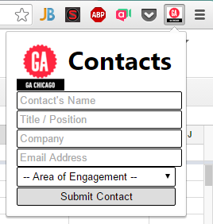

# Chrome Contacts Extension
Extension to allow GA Staff to submit all contacts to for centralized storage.

## Getting Started
* Clone down this repository.
* Open Google Chrome (or Chromium).
* Browse to `chrome://extensions/`
* Select **Load Unpacked Extension**
* Select this directory.
* Look for  and click it.
* You'll be asked for a username on the first launch - please enter your full name!
